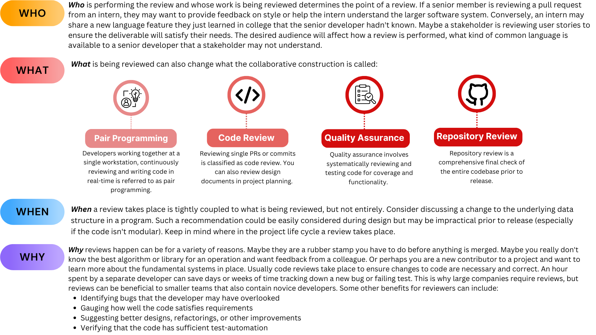

# Collaborative Construction

### Pair Programming and Code Review
With such a vast range of possible topics, we will focus here on Pair Programming
and Code Review at the level of a PR.  Pair programming is working together,
simultaneously with one person typing and the other providing guidance and
feedback.  Code Reviews of PRs are usually asynchronous and performed to ensure
incoming code has a specific purpose and meets quality standards.

## Mechanics and Methods
Code review requires two complementary skills: the mechanical actions of performing
the review through github (or another version control system) and the soft skills
of providing feedback.

  

It can be helpful to draw a comparison between code review and editing a
scientific paper. The mechanics of editing a paper may require learning how to
record changes, add comments or adjust references.  What you say in those comments
and what changes you suggest are part of the soft skills.  Perhaps even more
important is how you say it.

With software, we sometimes lose sight that there is no right or best answer.
For any problem that is non-trivial, multiple solutions are viable and the choice
between them requires balancing different trade offs often based on personal
experience.  There are many build systems for python.  You may have a preference
based on good or bad experiences you had in a prior project, but that doesn't
make it the correct decision.  Again relating to editing a manuscript, you
(probably) won't say something like "you picked the wrong colors in this graph"
or "you used this phrase incorrectly".  Even, in cases where factual errors are
present, it's more polite to focus on the writing instead of the writer.
Recommendations provided with respect are more likely to be followed or at
least considered.

What you decide to bring up in a review is personal, reflecting your background
knowledge, project goals, and even your mood during the review.  We can't cover
all possible things to review, just think of it as an exercise in copy-editing.
You have some knowledge that will help the code get better and you need to
share that in a way that will be received positively.  We will have some details
and guidance later, but try to approach reviews like you would prose, not a
mechanical drawing or mathematical proof.

## Developers are People Too
While you are writing code, you are ultimately producing instructions for the
machine.  You can be terse and uncaring because machines don't have feelings.
While you are writing reviews, you are providing feedback to a person.  Remember
they don't know everything you do (and vice versa) and that doesn't reflect on
their value as a person, their intelligence or even their capabilities.  Maybe
a PR was made to meet a deadline and there wasn't time to go back and refactor.
Perhaps you have a decade of experience with python while they picked it up a
year ago and are more comfortable with compiled languages.  Maybe they are also
handling a sick family member at home and are having trouble focusing.  So
before starting a review, remember to change your audience from computer to
people.

Practically, follow these suggestions:
- Criticize the code, not the coder.  In general, avoid using "you".  Replace phrases
like "you should have ..." with "we should consider ...".  In the latter version
you are taking partial ownership (we) and providing a suggestion instead of a
command.  You can remove the subject entirely: "Consider ..." or make a question
"What about ...".  In any case, you change focus from the actor, "you", to the
action.
- Be polite.  Instead of saying "It's stupid to use this algorithm" give the
reasons why an alternative would be better "When the sample size is above X,
it would be more memory efficient to do Y."
- Let a style guide (or formatter) dictate style.  There are no reasons to argue
over line wrapping or tab stops.  Decide on these early, setup CI and precommit
to enforce them and spend your time doing more important things.
- Give code examples, with context.  Instead of saying "Use f-strings" provide
a snippet of how the code will look.  But also don't just highlight the region
and give the code!  Remember sharing knowledge is an important part of reviews.
Explain that f-strings are generally faster and easier to read.  As a reviewee,
don't just accept code snippets.  Make sure you understand what the new code does
and why it may be a better option.  This may require some independent research.
- Give feedback, not commands.  All of your feedback is optional and it's helpful
to the reviewee to have reviews written as such.  Instead of "Rename this class
to X" say "Can we rename this class to X?  I think it...".  In the dialog that
follows, the reviewee can say "No, because of ..." or "Of course, that's a great
point."  You give them the option to say no without being confrontational.
- Give praise.  Reviews aren't just about mistakes and nitpicks.  If you see
a clever algorithm or clean refactoring, say it!  For teams you work with
continually, recognize signs of improvement.
- Make code better, not perfect.  Highlighting and fixing a few issues is
better than totally rewriting a PR and crushing a junior developers confidence.
- Recognize stalemates.  You don't have to win every battle and reviewees don't
have to accept every recommendation.  If you feel like a conversation is getting
personal and no longer constructive, reach out to a third party for help or agree
to disagree.

## Summary
Collaborative Construction is a heterogeneous topic that is important throughout
project lifetimes and has many different goals.  The mechanics of reviews are
separate from what to review.  Think of code reviews like editing a manuscript to
get into the right frame of mind and always remember the other developer is
a person. Your relationship may last several years or just this PR, but they
deserve respect and recognition.

In this module, we will cover pair programming and code review at the PR level.
While pair programming is less often utilized, it allows you to experience
providing guidance and feedback to a fellow developer without getting caught up
with the mechanics of performing a review.



